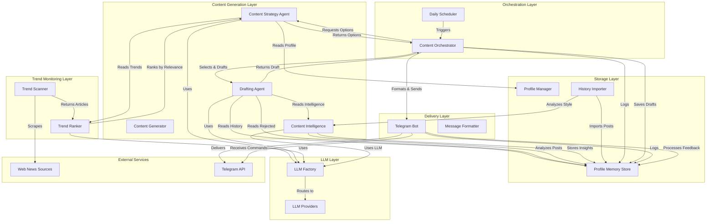
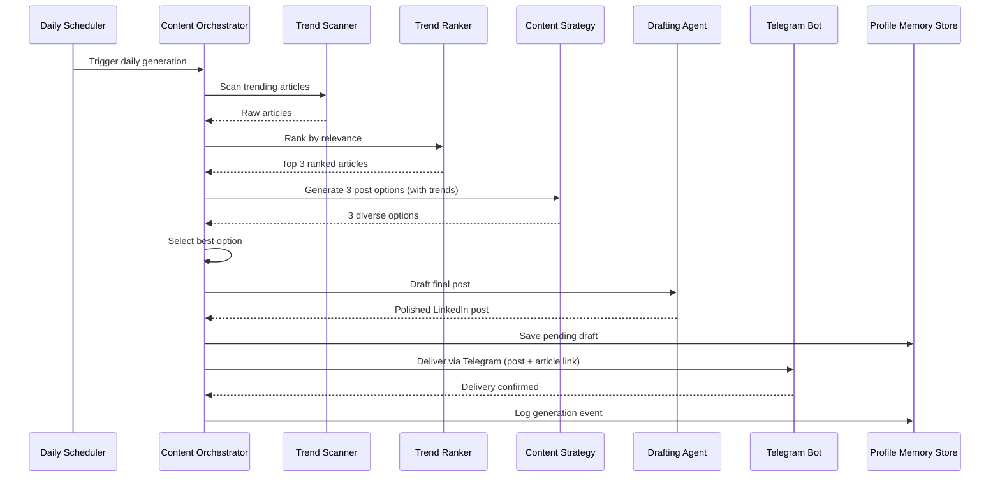

# LinkedIn Content Assistant - Design Document

## Overview

The LinkedIn Content Assistant is a safe, human-in-the-loop content generation system that creates authentic LinkedIn posts without direct automation risks. The system analyzes user profiles and writing styles, monitors trending content from LinkedIn feeds and web sources, generates one human-like post draft per day, and delivers it via Telegram for manual posting.

### Design Philosophy

1. **Safety First**: No direct LinkedIn posting - all content is delivered via Telegram for manual review and posting
2. **Authenticity**: Generated content matches the user's writing style to be indistinguishable from human writing
3. **Component Reuse**: Leverages proven components from the existing LinkedIn AI Manager codebase
4. **Modularity**: Clear separation between content generation, trend monitoring, delivery, and storage
5. **Human Control**: User maintains full control over what gets posted and when

### Key Differentiators from LinkedIn AI Manager

- **Read-Only LinkedIn Access**: Only reads feed data, never writes
- **No Credential Storage**: Does not store LinkedIn posting credentials
- **Manual Posting Workflow**: Content delivered via Telegram for copy-paste posting
- **Daily Generation**: One post per day maximum to maintain authenticity
- **Style Learning**: Analyzes previous posts to match writing patterns

## Architecture

### System Architecture Diagram



### Architecture Layers

**Content Generation Layer**: Responsible for creating LinkedIn post content
- Content Strategy Agent: Generates 3 diverse post options with different angles
- Drafting Agent: Converts selected option into polished LinkedIn post
- Content Intelligence: Analyzes historical posts for strategic direction and pattern learning
- Content Generator: Orchestrates the generation workflow

**Trend Monitoring Layer**: Tracks trending topics and news
- Trend Scanner: Monitors tech news sources (Hacker News, TechCrunch)
- Trend Ranker: Uses LLM to rank articles by relevance to user profile

**Orchestration Layer**: Coordinates daily workflows
- Daily Scheduler: Triggers content generation at configured times
- Content Orchestrator: Manages the end-to-end content generation flow

**Delivery Layer**: Sends content to user via Telegram
- Telegram Bot: Handles message delivery, formatting, and user feedback commands
- Message Formatter: Formats posts for copy-paste convenience

**Storage Layer**: Persists profiles, history, and trends
- Profile Manager: Manages profile configurations
- Profile Memory Store: Profile-specific storage for posts, style analysis, events, rejected posts, and pending drafts
- History Importer: Imports LinkedIn post history from browser-extracted JSON

**LLM Layer**: Provides language model capabilities
- LLM Factory: Routes requests to configured providers
- LLM Providers: Bedrock Claude, OpenAI, Anthropic integrations

### Component Reuse Strategy

The design leverages existing components from `AIManager/linkedin_ai_manager`:

| Component | Source | Adaptation Required |
|-----------|--------|---------------------|
| Profile Manager | `profiles/manager.py` | None - reuse as-is |
| LLM Factory | `llm/` | None - reuse as-is |
| Content Strategy Agent | `agents/content_strategy.py` | Enhanced with trending articles integration |
| Drafting Agent | `agents/drafting.py` | Enhanced with historical context and rejected posts |
| Telegram Bot | `delivery/telegram_bot.py` | Enhanced with user feedback commands (/posted, /skip, /regenerate) |

**New Components Built**:
- Profile Memory Store: Profile-specific storage structure (replaces single events.json)
- Content Intelligence: Rule-based + LLM-powered strategic analysis of historical posts
- History Importer: Browser-based LinkedIn post history extraction and import
- Trend Scanner: Web scraping for Hacker News and TechCrunch
- Trend Ranker: LLM-based article relevance ranking
- Content Orchestrator: Simplified workflow for daily generation with trending articles
- Main Application: Entry point with CLI commands (generate-once, listen, import-history, analyze-content, profile-stats)


## Components and Interfaces

### 1. Profile Manager (Reused)

**Responsibility**: Manage profile configurations including identity and behavior patterns

**Interface**:
```python
class ProfileManager:
    def load_profile(profile_id: str) -> ProfileConfig
    def save_profile(profile: ProfileConfig) -> None
    def create_profile(profile_id: str, config_data: Dict) -> ProfileConfig
    def list_profiles() -> List[str]
```

**Key Data Structures** (from existing implementation):
- `ProfileConfig`: Complete profile with identity, focus areas, target audience, writing style
- `SeniorityLevel`: Professional level enum
- `PostingWindow`: Time windows for content generation

**Configuration Storage**: YAML files in `profiles/active/` directory for human editability

### 2. Profile Memory Store (New Component)

**Responsibility**: Profile-specific storage for posts, style analysis, events, rejected posts, and pending drafts

**Interface**:
```python
class ProfileMemoryStore:
    def __init__(profile_id: str, data_dir: str)
    
    # Post history
    def add_post(post_data: Dict) -> None
    def get_posts(limit: int = None) -> List[Dict]
    def get_post_count() -> int
    
    # Style analysis
    def save_style_analysis(analysis: Dict) -> None
    def get_style_analysis() -> Optional[Dict]
    
    # Content intelligence
    def save_content_intelligence(intelligence: Dict) -> None
    def get_content_intelligence() -> Optional[Dict]
    async def analyze_content_intelligence_async(llm_factory: LLMFactory, refresh: bool) -> Dict
    
    # Pending drafts (FIFO queue)
    def add_pending_draft(draft: Dict, content_idea: Dict) -> None
    def pop_pending_draft() -> Optional[Dict]
    def peek_pending_draft() -> Optional[Dict]
    def replace_pending_draft(new_draft: Dict) -> None
    def get_pending_draft_count() -> int
    
    # Rejected posts
    def save_rejected_post(draft: Dict, reason: str) -> None
    def get_rejected_posts(limit: int = 10) -> List[Dict]
    
    # Events
    def add_event(event: Dict) -> None
    def get_events(limit: int = None) -> List[Dict]
```

**Storage Structure**:
```
data/memory/{profile_id}/
├── posts.json              # Historical posts
├── style_analysis.json     # Writing style patterns
├── content_intelligence.json  # Strategic insights
├── pending_drafts.json     # FIFO queue of drafts awaiting user action
├── rejected_posts.json     # Drafts user skipped
└── events.json            # System events log
```

**Key Features**:
- Profile isolation: Each profile has separate directory
- FIFO queue for pending drafts (supports multiple posts)
- Rejected posts tracking for learning
- Content intelligence caching
- Atomic file operations with backup

### 3. Content Intelligence (New Component)

**Responsibility**: Analyze historical posts to provide strategic direction for new content

**Interface**:
```python
class ContentIntelligence:
    def __init__(llm_factory: LLMFactory = None)
    
    async def analyze(posts: List[Dict]) -> Dict
    def _rule_based_analysis(posts: List[Dict]) -> Dict
    async def _llm_deep_analysis(posts: List[Dict]) -> Dict
```

**Analysis Components**:

**Rule-Based Analysis** (Fast, always runs):
- Content themes and topic clusters
- Engagement patterns (character count, hashtag usage)
- Content evolution tracking
- Knowledge domains identification
- Audience insights
- Content gaps identification
- Successful patterns (opening styles, structures, CTAs)
- Key messages extraction

**LLM Deep Analysis** (Optional, cached):
- Unique voice and positioning
- Core beliefs and values
- Semantic themes beyond keywords
- Engagement drivers (what resonates)
- Strategic opportunities (underexplored topics)
- Quality patterns (what works, what to avoid)

**Output Structure**:
```python
{
    "rule_based": {
        "themes": {...},
        "engagement_patterns": {...},
        "content_evolution": {...},
        "knowledge_domains": [...],
        "audience_insights": {...},
        "content_gaps": {...},
        "successful_patterns": {...}
    },
    "llm_insights": {
        "unique_voice": "...",
        "core_beliefs": [...],
        "semantic_themes": [...],
        "engagement_drivers": [...],
        "strategic_opportunities": [...],
        "quality_patterns": {...}
    },
    "strategic_direction": {
        "priority_topics": [...],
        "content_angles": [...],
        "audience_alignment": "...",
        "format_suggestions": [...]
    }
}
```


### 4. History Importer (New Component)

**Responsibility**: Import LinkedIn post history from browser-extracted JSON files

**Interface**:
```python
class HistoryImporter:
    def __init__(profile_store: ProfileMemoryStore)
    
    async def import_posts(file_path: str) -> ImportResult
    def _parse_post_data(raw_data: Dict) -> Dict
    def _extract_metadata(post: Dict) -> Dict
```

**Browser Extraction Tools**:
- `tools/linkedin_post_extractor.html`: Extracts regular posts from `/recent-activity/all/`
- `tools/linkedin_newsletter_extractor.html`: Extracts newsletter articles

**Import Workflow**:
1. User opens HTML file in browser
2. Navigates to LinkedIn profile activity page
3. Runs extraction script in browser console
4. Script scrolls and extracts all posts/articles
5. Downloads JSON file
6. User runs: `python3 -m linkedin_content_assistant.main import-history --profile {id} --file posts.json`
7. System stores posts and triggers style analysis

**Data Structures**:
```python
@dataclass
class ImportResult:
    success: bool
    posts_imported: int
    posts_skipped: int
    errors: List[str]
```

### 5. Trend Scanner (New Component)

**Responsibility**: Scrape tech news sources for trending articles

**Interface**:
```python
class TrendScanner:
    async def scan_all_sources() -> List[TrendingArticle]
    async def scan_hackernews() -> List[TrendingArticle]
    async def scan_techcrunch() -> List[TrendingArticle]
    async def fetch_article_content(url: str) -> Optional[str]
```

**Data Sources**:
- Hacker News (via API)
- TechCrunch (via web scraping)

**Data Structures**:
```python
@dataclass
class TrendingArticle:
    title: str
    url: str
    source: str
    score: int
    summary: Optional[str]
    content: Optional[str]
    published_date: Optional[datetime]
```

**Features**:
- Async HTTP requests with aiohttp
- HTML parsing with BeautifulSoup
- Article content fetching for context
- Rate limiting and error handling


### 6. Trend Ranker (New Component)

**Responsibility**: Use LLM to rank articles by relevance to user profile

**Interface**:
```python
class TrendRanker:
    def __init__(llm_factory: LLMFactory)
    
    async def rank_articles(
        articles: List[TrendingArticle],
        profile: ProfileConfig,
        top_n: int = 3
    ) -> List[RankedArticle]
```

**Data Structures**:
```python
@dataclass
class RankedArticle:
    article: TrendingArticle
    relevance_score: float
    reasoning: str
    suggested_angle: str
```

**Ranking Process**:
1. Build prompt with profile context and articles
2. LLM analyzes relevance to user's domains and audience
3. Returns top N articles with scores and suggested angles
4. Provides reasoning for each ranking

### 7. Content Strategy Agent (Enhanced)

**Responsibility**: Generate 3 diverse post options with different angles

**Interface** (from existing implementation):
```python
class ContentStrategyAgent(LinkedInAgent):
    def execute(
        context: ProfileContext,
        memory: ProfileMemoryStore,
        trending_articles: List[RankedArticle] = None
    ) -> AgentOutput
    def validate_output(output: AgentOutput) -> ValidationResult
```

**Enhancements**:
- Accepts `trending_articles` parameter
- Instructs LLM that at least ONE of 3 options should be based on a trending article
- Includes article context in prompt generation

**Output Structure**:
```python
@dataclass
class ContentStrategyOutput:
    post_options: List[PostOption]  # Always 3 options
    reasoning: str
    profile_alignment: Dict[str, Any]

@dataclass
class PostOption:
    angle: str
    hook: str
    target_audience: str
    content_theme: str
    estimated_engagement: str
    related_article: Optional[RankedArticle]  # NEW: Link to trending article if used
```

### 8. Drafting Agent (Enhanced)

**Responsibility**: Convert selected post option into polished LinkedIn post

**Interface** (from existing implementation):
```python
class DraftingAgent(LinkedInAgent):
    def execute(
        context: ProfileContext,
        memory: ProfileMemoryStore,
        content_idea: Dict
    ) -> AgentOutput
    def validate_output(output: AgentOutput) -> ValidationResult
```

**Enhancements**:
- Retrieves historical posts for style matching AND content awareness
- Retrieves rejected posts to avoid similar angles/topics
- Retrieves style analysis for pattern matching
- Retrieves content intelligence for strategic direction
- Strengthened character limit enforcement (800-1300 chars HARD LIMIT)
- Includes rejected posts as negative examples in prompt

**Output Structure**:
```python
@dataclass
class DraftingOutput:
    linkedin_post: LinkedInPost
    content_idea_used: ContentIdea
    tone_compliance: Dict[str, Any]
    formatting_applied: List[str]

@dataclass
class LinkedInPost:
    content: str
    hashtags: List[str]
    call_to_action: Optional[str]
    estimated_length: int
    tone_analysis: Dict[str, Any]
    formatting_notes: List[str]
    related_article: Optional[RankedArticle]  # NEW: Article link if post is based on trend
```


### 9. Content Orchestrator (New Component)

**Responsibility**: Coordinate the daily content generation workflow

**Interface**:
```python
class ContentOrchestrator:
    def __init__(
        profile_manager: ProfileManager,
        profile_store: ProfileMemoryStore,
        content_strategy_agent: ContentStrategyAgent,
        drafting_agent: DraftingAgent,
        llm_factory: LLMFactory,
        telegram_bot: TelegramBot
    )
    
    async def generate_daily_post(profile_id: str) -> DailyPostResult
    async def _get_trending_topics() -> List[RankedArticle]
    async def _select_best_option(options: List[PostOption], profile: ProfileConfig) -> PostOption
    async def _deliver_to_telegram(post: LinkedInPost, profile_id: str, article: Optional[RankedArticle]) -> bool
```

**Workflow**:


**Data Structures**:
```python
@dataclass
class DailyPostResult:
    success: bool
    post_draft: Optional[LinkedInPost]
    options_generated: int
    selected_option: Optional[PostOption]
    delivery_status: str
    error: Optional[str]
    timestamp: datetime
```

### 10. Telegram Bot (Enhanced)

**Responsibility**: Deliver post drafts to user via Telegram and handle user feedback

**Interface**:
```python
class TelegramBot:
    def __init__(config: TelegramConfig)
    
    async def connect() -> bool
    async def disconnect() -> None
    async def send_post_draft(post: LinkedInPost, profile_id: str, article: Optional[RankedArticle]) -> bool
    async def send_message(message: str) -> bool
    async def poll_updates() -> List[Dict]
    async def _handle_text_message(message: Dict) -> None
```

**Enhancements**:
- Split delivery into two messages:
  1. Clean post content (copy-paste ready, no heading)
  2. Metadata and action instructions
- Article link sent as separate message when present
- User feedback commands: `/posted`, `/skip`, `/regenerate`
- Async connection handling with proper cleanup

**Message Format**:
```
Message 1 (Post Content):
{post_content}

{hashtags}

📎 Related article link in comments  [if article present]

Message 2 (Metadata):
📊 Metadata:
• Theme: {content_theme}
• Tone: {tone}
• Length: {character_count} chars

📋 Commands:
/posted - Save to history
/skip - Reject this draft
/regenerate - Keep topic, new draft

Message 3 (Article Link, if present):
📎 Related Article:
{article_title}
Source: {article_source}
{article_url}
```

**User Feedback Workflow**:
- `/posted`: Pops oldest draft from queue → Saves to posts.json
- `/skip`: Pops oldest draft → Saves to rejected_posts.json with reason
- `/regenerate`: Peeks draft → Regenerates with same topic → Replaces in queue


### 11. Daily Scheduler (Adapted from Existing)

**Responsibility**: Trigger content generation at configured times

**Interface**:
```python
class DailyScheduler:
    def __init__(orchestrator: ContentOrchestrator, config: SchedulerConfig)
    
    def start() -> None
    async def stop() -> None
    def add_profile_schedule(profile_id: str, windows: List[PostingWindow]) -> None
    def remove_profile_schedule(profile_id: str) -> None
```

**Adaptations from Original**:
- Simplify to daily-only scheduling
- Support multiple posting windows per day
- Support skip days (weekends, holidays)
- Enforce 1 post per day limit

**Configuration**:
```python
@dataclass
class SchedulerConfig:
    posting_windows: List[PostingWindow]
    skip_days: List[int]  # 0=Monday, 6=Sunday
    timezone: str = "UTC"
    max_posts_per_day: int = 1
```

### 12. LLM Factory (Reused)

**Responsibility**: Route LLM requests to configured providers with fallback

**Interface** (from existing implementation):
```python
class LLMFactory:
    def __init__(config: LLMConfig)
    
    async def generate_with_system(
        system_prompt: str,
        user_prompt: str,
        temperature: float,
        max_tokens: int
    ) -> LLMResponse
```

**Configuration**:
```python
@dataclass
class LLMConfig:
    primary_provider: ProviderConfig
    fallback_providers: List[ProviderConfig]
    enable_fallback: bool = True
    
@dataclass
class ProviderConfig:
    provider: LLMProvider  # BEDROCK_CLAUDE, OPENAI, ANTHROPIC
    model: str
    api_key: Optional[str]
    region: Optional[str]
```

**Primary Provider**: AWS Bedrock Claude Sonnet 4.5 (inference profile: `us.anthropic.claude-sonnet-4-5-20250929-v1:0`)

**No modifications needed** - existing implementation provides required functionality.

## Data Models

### Profile Configuration

```yaml
# profiles/active/my-profile.yaml
profile_id: "my-profile"
name: "My Professional Profile"
version: 1
enabled: true
created_at: "2024-01-15T10:00:00Z"
last_updated: "2024-01-15T10:00:00Z"

identity:
  headline: "Senior Software Engineer | Cloud Architecture | AI/ML"
  current_role: "Senior SDE at AWS"
  seniority: "senior"
  
focus_areas:
  primary_domains:
    - "Data Engineering"
    - "Software Development"
    - "AWS"
    - "Big Data"
  secondary_domains:
    - "Career Development"
    - "Technical Leadership"
  
target_audience: "Software engineers, data engineers, and tech professionals"

writing_style:
  tone: "Professional yet approachable"
  voice: "First-person, experience-based"
  vocabulary: "Technical but accessible"
  sentence_structure: "Mix of short and medium sentences"
  
content_preferences:
  post_types:
    - "Technical insights"
    - "Career lessons"
    - "Industry trends"
  avoid_topics:
    - "Politics"
    - "Religion"
    - "Controversial social issues"
  
posting_schedule:
  posting_windows:
    - start_hour: 9
      end_hour: 11
    - start_hour: 14
      end_hour: 16
  skip_days: [5, 6]  # Saturday, Sunday
```

### Profile Memory Storage

**Directory Structure**:
```
data/memory/{profile_id}/
├── posts.json              # Historical posts
├── style_analysis.json     # Writing style patterns
├── content_intelligence.json  # Strategic insights
├── pending_drafts.json     # FIFO queue of drafts
├── rejected_posts.json     # Skipped drafts
└── events.json            # System events log
```

**posts.json**:
```json
[
  {
    "id": "uuid",
    "content": "Post content...",
    "hashtags": ["#AWS", "#DataEngineering"],
    "published_date": "2024-01-15T10:00:00Z",
    "engagement": {
      "likes": 45,
      "comments": 12,
      "shares": 8
    },
    "metadata": {
      "source": "manual_import",
      "character_count": 850
    }
  }
]
```

**style_analysis.json**:
```json
{
  "analyzed_at": "2024-01-15T10:00:00Z",
  "post_count": 96,
  "patterns": {
    "post_length": {
      "min": 450,
      "max": 1500,
      "avg": 892,
      "median": 850
    },
    "emoji_usage": {
      "frequency": "moderate",
      "avg_per_post": 2.3,
      "common_emojis": ["💡", "🚀", "📊"]
    },
    "hashtag_usage": {
      "avg_per_post": 4.2,
      "common_tags": ["#AWS", "#DataEngineering", "#SoftwareDevelopment"]
    },
    "sentence_structure": {
      "avg_length": 18.5,
      "variance": 8.2
    },
    "opening_patterns": [
      "Personal experience story",
      "Question to audience",
      "Contrarian observation"
    ]
  }
}
```

**content_intelligence.json**:
```json
{
  "analyzed_at": "2024-01-15T10:00:00Z",
  "post_count": 96,
  "rule_based": {
    "themes": {
      "software_development": 35,
      "data_engineering": 28,
      "career_development": 18,
      "aws_cloud": 15
    },
    "engagement_patterns": {
      "high_engagement_length": 892,
      "best_posting_times": ["09:00-11:00", "14:00-16:00"]
    },
    "content_gaps": {
      "technical_depth": ["Performance optimization", "Database internals"],
      "career_development": ["Salary negotiation", "Interview preparation"]
    }
  },
  "llm_insights": {
    "unique_voice": "Pragmatic engineering focused on fundamentals over trends",
    "core_beliefs": [
      "Mastering fundamentals > chasing tools",
      "Ownership leads to growth"
    ],
    "semantic_themes": [
      "Fundamentals vs. Trends",
      "Ownership and Responsibility",
      "Learning and Growth"
    ],
    "strategic_opportunities": [
      "Soft skills in technical roles",
      "Case studies of failures",
      "Mentorship experiences"
    ]
  },
  "strategic_direction": {
    "priority_topics": [
      "Data pipeline optimization",
      "Career growth strategies",
      "AWS best practices"
    ],
    "content_angles": [
      "Personal lessons learned",
      "Practical how-to guides",
      "Industry trend analysis"
    ]
  }
}
```

**pending_drafts.json** (FIFO Queue):
```json
[
  {
    "draft": {
      "content": "Post content...",
      "hashtags": ["#AWS", "#DataEngineering"],
      "metadata": {
        "theme": "AWS Lambda optimization",
        "tone": "professional",
        "length": 1050
      }
    },
    "content_idea": {
      "angle": "Cost optimization strategies",
      "hook": "Personal experience with Lambda costs",
      "target_audience": "Cloud engineers"
    },
    "related_article": {
      "title": "New AWS Lambda pricing model",
      "url": "https://...",
      "source": "TechCrunch"
    },
    "created_at": "2024-01-15T10:00:00Z"
  }
]
```

**rejected_posts.json**:
```json
[
  {
    "draft": {
      "content": "Post content...",
      "hashtags": ["#AWS"],
      "metadata": {...}
    },
    "reason": "user_skipped",
    "rejected_at": "2024-01-15T11:00:00Z"
  }
]
```

### Configuration File

```yaml
# config/config.yaml
system:
  environment: "production"
  log_level: "INFO"
  data_dir: "./data"

profiles:
  directory: "./profiles/active"
  auto_load: true

memory:
  storage_type: "json"
  directory: "./data/memory"
  retention_days: 90

scheduler:
  enabled: true
  check_interval: 60  # seconds
  max_concurrent_jobs: 1

llm:
  primary_provider: "bedrock_claude"
  primary_model: "us.anthropic.claude-sonnet-4-5-20250929-v1:0"  # Inference profile
  fallback_enabled: true
  temperature: 0.75
  max_tokens: 2000
  region: "us-west-2"

telegram:
  enabled: true
  bot_token: "${TELEGRAM_BOT_TOKEN}"
  chat_id: "${TELEGRAM_CHAT_ID}"

trends:
  enabled: true
  sources:
    - "hackernews"
    - "techcrunch"
  top_n: 3
  request_timeout: 30

safety:
  max_posts_per_day: 1
  require_manual_posting: true
  store_linkedin_credentials: false
  enable_rate_limiting: true
```

### CLI Commands

```bash
# Generate a single post
python3 -m linkedin_content_assistant.main generate-once --profile {profile_id}

# Listen for Telegram commands (/posted, /skip, /regenerate)
python3 -m linkedin_content_assistant.main listen --profile {profile_id}

# Import LinkedIn post history
python3 -m linkedin_content_assistant.main import-history --profile {profile_id} --file posts.json

# Analyze content intelligence
python3 -m linkedin_content_assistant.main analyze-content --profile {profile_id} [--refresh]

# View profile statistics
python3 -m linkedin_content_assistant.main profile-stats --profile {profile_id}

# Migrate data from old format to profile-specific structure
python3 -m linkedin_content_assistant.main migrate-data --profile {profile_id}
```


## Implemented Features

### LinkedIn Post History Import System

**Browser-Based Extraction**: Safe, manual approach using browser console scripts
- `tools/linkedin_post_extractor.html`: Extracts regular posts from activity feed
- `tools/linkedin_newsletter_extractor.html`: Extracts newsletter articles
- Scripts scroll through profile, extract all posts, download as JSON
- User imports via CLI: `import-history --profile {id} --file posts.json`

**Benefits**:
- No LinkedIn API credentials needed
- No risk of account restrictions
- User maintains full control
- One-time manual process

### Profile-Specific Storage Structure

**Migration from Single File**: Moved from `data/memory/events.json` to profile-specific directories
- Each profile has isolated directory: `data/memory/{profile_id}/`
- Separate files: `posts.json`, `style_analysis.json`, `content_intelligence.json`, `pending_drafts.json`, `rejected_posts.json`, `events.json`
- Easy multi-profile support
- Better organization and scalability
- Simple backup/restore per profile

### Content Intelligence System

**Hybrid Analysis Approach**: Combines fast rule-based analysis with deep LLM insights

**Rule-Based Analysis** (Always runs, cached):
- Content themes and topic clusters
- Engagement patterns (character count, hashtag usage)
- Content evolution tracking
- Knowledge domains identification
- Audience insights
- Content gaps identification
- Successful patterns (opening styles, structures, CTAs)

**LLM Deep Analysis** (Optional, cached):
- Unique voice and positioning
- Core beliefs and values
- Semantic themes beyond keywords
- Engagement drivers
- Strategic opportunities
- Quality patterns

**Strategic Direction**: Priority topics, content angles, audience alignment, format suggestions

### Trending Articles Integration

**Multi-Source Scanning**:
- Hacker News (via API)
- TechCrunch (via web scraping)
- Async HTTP requests with aiohttp
- Article content fetching for context

**LLM-Based Ranking**:
- Ranks articles by relevance to user profile
- Returns top 3 with relevance scores
- Provides suggested content angles
- Includes reasoning for each ranking

**Content Generation Integration**:
- At least ONE of 3 post options based on trending article
- Article link sent separately in Telegram
- User can post link as comment on LinkedIn

### User Feedback Commands

**Three-Command System**:

1. `/posted`: Saves draft to history
   - Pops oldest draft from pending queue
   - Adds to `posts.json` with timestamp
   - Clears from pending drafts

2. `/skip`: Rejects draft
   - Pops oldest draft from pending queue
   - Saves to `rejected_posts.json` with reason
   - LLM learns from rejected posts to avoid similar angles

3. `/regenerate`: New draft, same topic
   - Keeps same topic/angle
   - Generates new execution
   - Replaces draft in queue
   - Useful when direction is good but execution needs work

**FIFO Queue System**: Supports multiple pending drafts without loss

### Character Limit Enforcement

**Strengthened Prompt Engineering**:
- System prompt: "⚠️ CRITICAL: Post content MUST be 800-1300 characters (HARD LIMIT)"
- Explicit character limit section in user prompt
- LLM generates within limits from the start
- Relaxed validation tolerance (500 chars) for edge cases

### AWS Bedrock Integration

**Primary LLM Provider**: AWS Bedrock Claude Sonnet 4.5
- Model: `us.anthropic.claude-sonnet-4-5-20250929-v1:0` (inference profile)
- Fixed API format: separate `system` parameter (not in messages array)
- Proper error handling and fallback support


## Correctness Properties

*A property is a characteristic or behavior that should hold true across all valid executions of a system—essentially, a formal statement about what the system should do. Properties serve as the bridge between human-readable specifications and machine-verifiable correctness guarantees.*

### Property 1: Profile Data Round-Trip Preservation

*For any* valid ProfileConfig, serializing to YAML then deserializing should produce an equivalent ProfileConfig with all fields preserved.

**Validates: Requirements 1.1, 1.4**

### Property 2: Profile Data Validation Rejects Invalid Input

*For any* profile data missing required fields (headline, seniority, primary_domains, target_audience, positioning), the Profile_Store should reject storage and raise a validation error.

**Validates: Requirements 1.2**

### Property 3: Profile Version Increment on Update

*For any* ProfileConfig, when behavior configuration is updated, the resulting profile should have a version number exactly one greater than the original.

**Validates: Requirements 1.3**

### Property 4: Multiple Profile Independence

*For any* two distinct profile IDs, storing and retrieving profiles should maintain independence such that updates to one profile do not affect the other profile's data.

**Validates: Requirements 1.5**

### Property 5: Style Learning Pattern Extraction

*For any* set of posts with known vocabulary patterns (casual, professional, technical, academic), the Style_Learner should extract patterns that match the dominant style in the input posts.

**Validates: Requirements 2.1**

### Property 6: High-Engagement Hook Identification

*For any* set of posts with engagement metrics, the Style_Learner should identify hooks from posts with engagement above the median, not from posts below the median.

**Validates: Requirements 2.2**

### Property 7: Emoji Pattern Analysis

*For any* set of posts with known emoji usage patterns, the Style_Learner should correctly classify emoji frequency (none, low, moderate, high) based on emoji count per post.

**Validates: Requirements 2.3**

### Property 8: Style Pattern Persistence

*For any* profile, after running style learning and storing patterns, retrieving the profile should return a BehaviorConfig containing the learned vocabulary_bias, hook_patterns, and emoji_frequency.

**Validates: Requirements 2.5**

### Property 9: Post Length Constraint

*For any* generated LinkedIn post, the content length should be between 500 and 1300 characters inclusive.

**Validates: Requirements 3.4**

### Property 10: Hashtag Count Constraint

*For any* generated LinkedIn post, the number of hashtags should be between 3 and 5 inclusive.

**Validates: Requirements 3.5**

### Property 11: Theme Repetition Avoidance

*For any* content generation request with recent post history containing specific themes, the generated post should not use any theme that appears in the last 10 posts.

**Validates: Requirements 3.6**

### Property 12: Call-to-Action Presence

*For any* generated LinkedIn post, the content should contain either a question mark (indicating a question) or imperative verbs suggesting action (e.g., "share", "comment", "try", "check out").

**Validates: Requirements 3.7**


### Property 13: AI Phrase Blacklist Enforcement

*For any* generated LinkedIn post, the content should not contain generic AI phrases from the blacklist: "delve into", "in conclusion", "it's important to note", "dive deep", "unpack", "leverage", "paradigm shift".

**Validates: Requirements 4.3**

### Property 14: Sentence Length Variance

*For any* generated LinkedIn post with learned sentence length patterns, the variance in sentence lengths should be within 20% of the learned variance from the user's writing style.

**Validates: Requirements 4.5**

### Property 15: Emoji Placement Consistency

*For any* generated LinkedIn post where the profile specifies emoji usage, emoji placement should match the learned pattern (start, end, inline, or mixed).

**Validates: Requirements 4.6**

### Property 16: Feed Scanner Read-Only Constraint

*For any* feed scanning session, the system should only perform HTTP GET requests to LinkedIn, never POST, PUT, PATCH, or DELETE requests.

**Validates: Requirements 5.1, 8.1**

### Property 17: High-Engagement Post Identification

*For any* set of feed posts with engagement metrics, posts identified as "high engagement" should have engagement scores (likes + comments + shares) above the 75th percentile of all scanned posts.

**Validates: Requirements 5.2**

### Property 18: Trending Topic Storage Completeness

*For any* trending topic identified by the Feed_Scanner, the stored MemoryEvent should contain the topic name, timestamp, engagement metrics, and source attribution.

**Validates: Requirements 5.5**

### Property 19: Domain Relevance Filtering

*For any* set of trending topics and a profile with primary domains, filtered topics should only include those where at least one domain keyword appears in the topic text or related content.

**Validates: Requirements 5.6, 6.3**

### Property 20: Web Scraper Rate Limit Respect

*For any* web scraping session where a source returns HTTP 429 (rate limit), the Web_Scraper should implement exponential backoff with delays of 5s, 10s, 20s, 40s before retrying.

**Validates: Requirements 6.7, 10.7, 13.5**

### Property 21: News Item Storage with Attribution

*For any* news item scraped from web sources, the stored MemoryEvent should contain the article title, summary, URL, source name, and publication date.

**Validates: Requirements 6.4**

### Property 22: Cross-Source Trend Detection

*For any* set of news items from multiple sources, topics appearing in 2 or more distinct sources should be identified as cross-source trends.

**Validates: Requirements 6.5**

### Property 23: Trend Aggregation Completeness

*For any* profile, the Trend_Monitor should provide trends that include both LinkedIn feed trends and web news trends when both sources have data.

**Validates: Requirements 6.6**

### Property 24: Telegram Message Formatting Completeness

*For any* LinkedIn post delivered via Telegram, the message should contain the post content, hashtags, theme, tone, length, and estimated engagement type.

**Validates: Requirements 7.2, 7.3**

### Property 25: Telegram Delivery Retry Logic

*For any* Telegram delivery failure, the system should retry exactly 3 times with exponential backoff delays before marking the delivery as failed.

**Validates: Requirements 7.6**

### Property 26: Delivery Logging Completeness

*For any* Telegram delivery attempt (success or failure), a MemoryEvent of type "post_delivered" or "delivery_failed" should be stored with timestamp and outcome.

**Validates: Requirements 7.7**


### Property 27: No LinkedIn Credential Storage

*For any* system configuration or stored data, there should be no LinkedIn username, password, session token, or authentication credential stored anywhere in the Profile_Store, Memory_Store, or configuration files.

**Validates: Requirements 8.2**

### Property 28: Manual Posting Instructions Presence

*For any* Telegram message containing a post draft, the message text should include instructions indicating that content must be manually posted to LinkedIn.

**Validates: Requirements 8.3**

### Property 29: Draft Status Tracking

*For any* post draft, the Memory_Store should support recording one of three states: "posted", "skipped", or "edited_then_posted".

**Validates: Requirements 8.5, 11.2**

### Property 30: Post Option Uniqueness

*For any* set of 3 generated post options, each option should have a unique angle such that no two angles share more than 50% of their words.

**Validates: Requirements 9.2**

### Property 31: Best Option Selection by Score

*For any* set of post options with confidence scores, the selected option should be the one with the highest confidence score.

**Validates: Requirements 9.4**

### Property 32: All Options Storage

*For any* content generation session that produces 3 post options, all 3 options should be stored in Memory_Store, not just the selected option.

**Validates: Requirements 9.5**

### Property 33: Angle Repetition Avoidance

*For any* content generation request with recent post history containing specific angles, the generated post options should not use any angle that appears in the last 10 posts.

**Validates: Requirements 9.6**

### Property 34: LLM Provider Fallback

*For any* LLM generation request where the primary provider fails with an error, the LLM_Provider should automatically attempt the request with the first configured fallback provider.

**Validates: Requirements 10.3**

### Property 35: Provider Failure Logging

*For any* LLM provider failure or fallback event, a log entry should be created containing the provider name, error message, and timestamp.

**Validates: Requirements 10.4**

### Property 36: Token Usage Tracking

*For any* LLM generation request, the system should track and store the token count and provider used in the request metadata.

**Validates: Requirements 10.5**

### Property 37: Temperature Configuration

*For any* content generation LLM request, the temperature parameter should be set between 0.7 and 0.8 inclusive.

**Validates: Requirements 10.6**

### Property 38: Post Draft Storage Completeness

*For any* generated post draft, the stored MemoryEvent should contain the post content, hashtags, theme, tone, length, timestamp, and generation metadata.

**Validates: Requirements 11.1**

### Property 39: Engagement Metrics Storage

*For any* post marked as "posted" with engagement metrics provided, the Memory_Store should store likes, comments, shares, and impressions counts.

**Validates: Requirements 11.3**

### Property 40: Post History Query by Criteria

*For any* query to Memory_Store for recent posts, the system should support filtering by date range, theme, or engagement level and return matching posts.

**Validates: Requirements 11.4**

### Property 41: Post History Retrieval for Repetition Avoidance

*For any* content generation request, the Content_Generator should be able to retrieve the last 10 posts from Memory_Store for the profile.

**Validates: Requirements 11.6**

### Property 42: History Export Completeness

*For any* export request for a date range, the Memory_Store should return all post events within that range with complete data (content, metrics, timestamps).

**Validates: Requirements 11.7**


### Property 43: Posting Window Configuration Support

*For any* profile configuration with posting windows, the Daily_Scheduler should accept and store multiple PostingWindow objects with valid start_hour and end_hour values (0-23).

**Validates: Requirements 12.1**

### Property 44: Multiple Posting Windows Support

*For any* profile with multiple posting windows configured, the scheduler should support triggering generation within any of the configured windows.

**Validates: Requirements 12.3**

### Property 45: Skip Days Enforcement

*For any* profile with skip_days configured (e.g., [5, 6] for weekends), the scheduler should not trigger content generation on those days of the week.

**Validates: Requirements 12.4**

### Property 46: Configuration Loading

*For any* valid configuration file or environment variables, the Content_Assistant should successfully load all configuration values on startup.

**Validates: Requirements 12.5**

### Property 47: Configuration Validation on Startup

*For any* invalid configuration (missing required fields, invalid values), the Content_Assistant should raise a validation error and refuse to start.

**Validates: Requirements 12.6, 12.7**

### Property 48: Feed Scan Post Limit

*For any* feed scanning session, the Feed_Scanner should read a maximum of 50 posts and stop, even if more posts are available.

**Validates: Requirements 13.1**

### Property 49: Feed Read Delays

*For any* feed scanning session reading multiple posts, there should be a delay of at least 3 seconds between consecutive post reads.

**Validates: Requirements 13.2**

### Property 50: Robots.txt Respect

*For any* web scraping request, the Web_Scraper should check robots.txt for the target domain and skip scraping if disallowed.

**Validates: Requirements 13.3**

### Property 51: Daily Post Generation Limit

*For any* 24-hour period, the Content_Assistant should generate at most 1 post draft per profile, rejecting additional generation requests.

**Validates: Requirements 13.4**

### Property 52: Rate Limit Logging

*For any* rate limit encounter (HTTP 429 or similar), the system should create a log entry with the service name, timestamp, and backoff duration.

**Validates: Requirements 13.6**

### Property 53: LinkedIn Rate Limit Pause

*For any* LinkedIn API rate limit error (HTTP 429), the Feed_Scanner should pause for at least 3600 seconds (1 hour) before retrying.

**Validates: Requirements 13.7**

### Property 54: Error Logging with Stack Traces

*For any* exception or error that occurs during system operation, a log entry should be created containing the error message, stack trace, and timestamp.

**Validates: Requirements 14.2**

### Property 55: LLM Token Usage Reporting

*For any* LLM generation request, the system should track and make available the total token count and estimated cost for reporting.

**Validates: Requirements 14.3**

### Property 56: Telegram Delivery Success Rate Tracking

*For any* set of Telegram delivery attempts, the system should calculate and report the success rate as (successful_deliveries / total_attempts).

**Validates: Requirements 14.4**

### Property 57: Critical Error Alerting

*For any* critical error (system crash, configuration failure, repeated LLM failures), the system should send an alert message via Telegram to the configured chat.

**Validates: Requirements 14.5**

### Property 58: Content Generation Success Rate Tracking

*For any* set of content generation attempts, the system should track and report the success rate as (successful_generations / total_attempts).

**Validates: Requirements 14.6**

### Property 59: Daily Summary Logging

*For any* 24-hour period, the system should create a summary log entry containing counts of posts generated, trends monitored, deliveries attempted, and delivery success rate.

**Validates: Requirements 14.7**


## Error Handling

### Error Categories

**1. Configuration Errors**
- Invalid or missing configuration values
- Invalid profile data
- Missing required credentials (Telegram, LLM)

**Handling Strategy**:
- Validate all configuration on startup
- Fail fast with detailed error messages
- Do not start system if configuration is invalid
- Log configuration errors with specific field names

**2. External Service Errors**
- LLM provider failures (timeout, rate limit, API error)
- Telegram API failures
- LinkedIn feed access errors
- Web scraping failures

**Handling Strategy**:
- Implement exponential backoff retry logic
- Use fallback providers for LLM
- Log all external service errors with context
- Continue operation if non-critical service fails
- Alert user via Telegram for critical failures

**3. Data Storage Errors**
- Profile save/load failures
- Memory store write failures
- Disk space issues

**Handling Strategy**:
- Retry storage operations up to 3 times
- Log detailed error information
- Alert user if persistent storage fails
- Maintain in-memory cache as fallback

**4. Content Generation Errors**
- LLM returns invalid JSON
- Generated content violates constraints
- Style learning fails

**Handling Strategy**:
- Validate all LLM outputs before use
- Retry generation with adjusted prompts
- Fall back to simpler generation if complex fails
- Log generation failures for analysis
- Skip daily post if all retries fail

### Error Recovery Workflows

**LLM Provider Failure**:
```
1. Primary provider fails
2. Log failure with error details
3. Attempt fallback provider #1
4. If fails, attempt fallback provider #2
5. If all fail, log critical error and alert user
6. Skip content generation for this cycle
```

**Telegram Delivery Failure**:
```
1. Initial delivery attempt fails
2. Wait 5 seconds (exponential backoff: 5s, 10s, 20s)
3. Retry delivery (max 3 retries)
4. If all retries fail:
   - Log delivery failure
   - Store draft in memory for manual retrieval
   - Alert user via next successful connection
```

**Feed Scanner Rate Limit**:
```
1. Detect HTTP 429 response
2. Extract retry-after header if present
3. Pause for max(retry-after, 3600 seconds)
4. Log rate limit encounter
5. Resume scanning after pause
6. Reduce scan frequency if repeated rate limits
```

### Resilience Patterns

**Circuit Breaker for External Services**:
- Track failure rate for each external service
- Open circuit after 5 consecutive failures
- Half-open after 5 minutes to test recovery
- Close circuit after 3 consecutive successes

**Graceful Degradation**:
- If Feed_Scanner fails: Use only Web_Scraper trends
- If Web_Scraper fails: Use only LinkedIn trends
- If both fail: Generate content without trend context
- If Telegram fails: Store drafts for manual retrieval

**Timeout Configuration**:
- LLM requests: 60 seconds
- Web scraping: 30 seconds
- Telegram API: 30 seconds
- Feed scanning: 45 seconds per post


## Testing Strategy

### Dual Testing Approach

The testing strategy employs both unit tests and property-based tests as complementary approaches:

**Unit Tests**: Verify specific examples, edge cases, and error conditions
- Specific configuration scenarios
- Error handling paths
- Integration points between components
- Edge cases like empty inputs, boundary values

**Property-Based Tests**: Verify universal properties across all inputs
- Data serialization/deserialization
- Constraint enforcement (length, count limits)
- Filtering and selection logic
- Rate limiting and retry behavior

Together, these approaches provide comprehensive coverage where unit tests catch concrete bugs and property tests verify general correctness.

### Property-Based Testing Configuration

**Framework Selection by Language**:
- Python: Hypothesis
- JavaScript/TypeScript: fast-check
- Java: jqwik
- Go: gopter

**Test Configuration**:
- Minimum 100 iterations per property test (due to randomization)
- Each property test must reference its design document property
- Tag format: `Feature: linkedin-content-assistant, Property {number}: {property_text}`

**Example Property Test Structure**:
```python
from hypothesis import given, strategies as st
import pytest

@given(
    profile=st.builds(ProfileConfig, ...),
)
def test_property_3_profile_version_increment(profile):
    """
    Feature: linkedin-content-assistant, Property 3: Profile Version Increment on Update
    
    For any ProfileConfig, when behavior configuration is updated, 
    the resulting profile should have a version number exactly one 
    greater than the original.
    """
    original_version = profile.version
    updated_profile = profile.increment_version()
    
    assert updated_profile.version == original_version + 1
```

### Unit Testing Strategy

**Component-Level Tests**:

**Profile Store**:
- Test valid profile creation and storage
- Test invalid profile rejection
- Test profile retrieval by ID
- Test profile update operations
- Test YAML serialization edge cases

**Style Learner**:
- Test vocabulary pattern extraction with known samples
- Test emoji frequency classification
- Test hook pattern identification
- Test behavior config updates
- Test handling of empty or malformed posts

**Content Generator**:
- Test post length constraints with boundary values
- Test hashtag count constraints
- Test theme repetition avoidance with specific history
- Test call-to-action detection
- Test AI phrase blacklist enforcement

**Feed Scanner**:
- Test read-only constraint (mock HTTP calls)
- Test post limit enforcement (50 max)
- Test high-engagement identification
- Test topic extraction
- Test rate limit handling

**Web Scraper**:
- Test robots.txt respect
- Test rate limit detection and backoff
- Test article data extraction
- Test cross-source trend detection
- Test timeout handling

**Telegram Bot**:
- Test message formatting completeness
- Test retry logic with simulated failures
- Test delivery logging
- Test copy-paste optimization

**Content Orchestrator**:
- Test daily generation workflow
- Test option selection logic
- Test generation limit enforcement (1/day)
- Test error recovery paths

### Integration Testing

**End-to-End Workflow Tests**:
1. Profile creation → Style learning → Content generation → Telegram delivery
2. Feed scanning → Trend detection → Content generation with trends
3. Web scraping → Trend aggregation → Content generation
4. Configuration loading → Scheduler start → Daily generation trigger

**External Service Mocking**:
- Mock LLM providers with controlled responses
- Mock Telegram API with success/failure scenarios
- Mock LinkedIn feed with sample data
- Mock web sources with sample HTML

### Test Data Generators

**Profile Generator**:
```python
def generate_profile(
    seniority: SeniorityLevel = None,
    domains: List[str] = None,
    vocabulary: str = None
) -> ProfileConfig
```

**Post Generator**:
```python
def generate_post(
    length: int = None,
    hashtag_count: int = None,
    theme: str = None,
    has_cta: bool = True
) -> str
```

**Feed Post Generator**:
```python
def generate_feed_post(
    engagement_level: str = "high",
    topics: List[str] = None
) -> FeedPost
```

### Test Coverage Goals

- Unit test coverage: >80% for all components
- Property test coverage: All 59 correctness properties
- Integration test coverage: All major workflows
- Error path coverage: All error handling branches

### Continuous Testing

**Pre-Commit Checks**:
- Run unit tests
- Run fast property tests (10 iterations)
- Check code formatting
- Run linters

**CI/CD Pipeline**:
- Run full unit test suite
- Run full property tests (100 iterations)
- Run integration tests
- Generate coverage reports
- Run security scans

