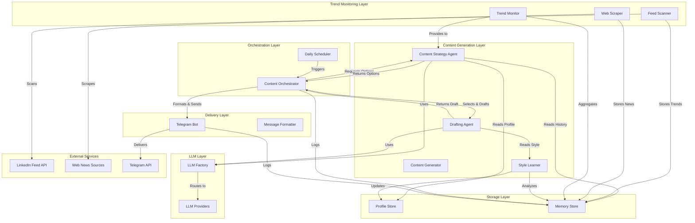
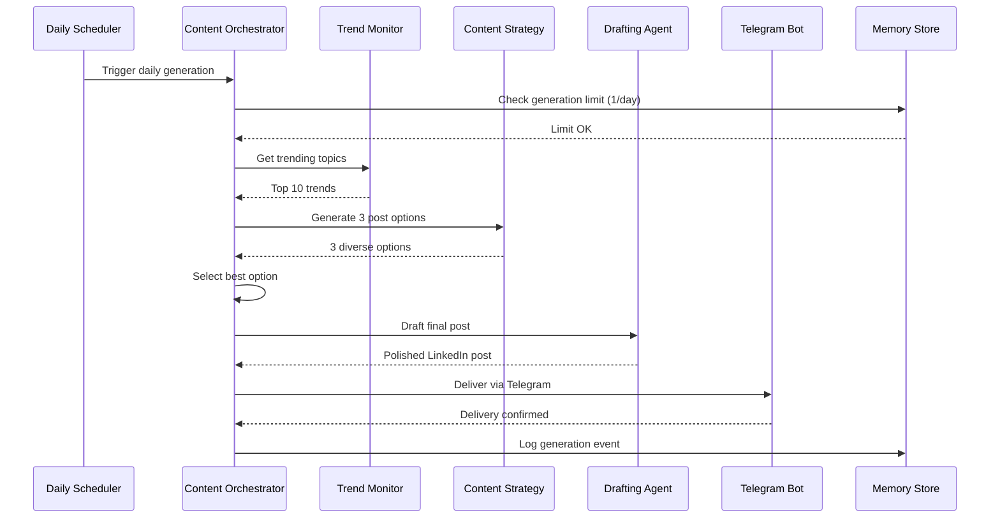

# LinkedIn Content Assistant - Design Document

## Overview

The LinkedIn Content Assistant is a safe, human-in-the-loop content generation system that creates authentic LinkedIn posts without direct automation risks. The system analyzes user profiles and writing styles, monitors trending content from LinkedIn feeds and web sources, generates one human-like post draft per day, and delivers it via Telegram for manual posting.

### Design Philosophy

1. **Safety First**: No direct LinkedIn posting - all content is delivered via Telegram for manual review and posting
2. **Authenticity**: Generated content matches the user's writing style to be indistinguishable from human writing
3. **Component Reuse**: Leverages proven components from the existing LinkedIn AI Manager codebase
4. **Modularity**: Clear separation between content generation, trend monitoring, delivery, and storage
5. **Human Control**: User maintains full control over what gets posted and when

### Key Differentiators from LinkedIn AI Manager

- **Read-Only LinkedIn Access**: Only reads feed data, never writes
- **No Credential Storage**: Does not store LinkedIn posting credentials
- **Manual Posting Workflow**: Content delivered via Telegram for copy-paste posting
- **Daily Generation**: One post per day maximum to maintain authenticity
- **Style Learning**: Analyzes previous posts to match writing patterns

## Architecture

### System Architecture Diagram



### Architecture Layers

**Content Generation Layer**: Responsible for creating LinkedIn post content
- Content Strategy Agent: Generates 3 diverse post options with different angles
- Drafting Agent: Converts selected option into polished LinkedIn post
- Style Learner: Analyzes writing patterns from post history
- Content Generator: Orchestrates the generation workflow

**Trend Monitoring Layer**: Tracks trending topics and news
- Feed Scanner: Reads LinkedIn feed for trending posts (read-only)
- Web Scraper: Monitors tech news sources
- Trend Monitor: Aggregates trends from multiple sources

**Orchestration Layer**: Coordinates daily workflows
- Daily Scheduler: Triggers content generation at configured times
- Content Orchestrator: Manages the end-to-end content generation flow

**Delivery Layer**: Sends content to user via Telegram
- Telegram Bot: Handles message delivery and formatting
- Message Formatter: Formats posts for copy-paste convenience

**Storage Layer**: Persists profiles, history, and trends
- Profile Store: Manages profile configurations and learned styles
- Memory Store: Stores post history, trends, and engagement metrics

**LLM Layer**: Provides language model capabilities
- LLM Factory: Routes requests to configured providers
- LLM Providers: Bedrock Claude, OpenAI, Anthropic integrations

### Component Reuse Strategy

The design leverages existing components from `AIManager/linkedin_ai_manager`:

| Component | Source | Adaptation Required |
|-----------|--------|---------------------|
| Profile Store | `profiles/` | None - reuse as-is |
| Memory Store | `memory/` | None - reuse as-is |
| LLM Factory | `llm/` | None - reuse as-is |
| Content Strategy Agent | `agents/content_strategy.py` | None - reuse as-is |
| Drafting Agent | `agents/drafting.py` | None - reuse as-is |
| Feed Scanner Agent | `agents/feed_scanner.py` | Remove comment generation (read-only) |
| Telegram Bot | `ui/telegram_bot.py` | Simplify for delivery-only mode |
| Scheduler | `scheduler/` | Adapt for daily-only scheduling |

**New Components to Build**:
- Style Learner: Analyzes writing patterns from post history
- Web Scraper: Monitors tech news sources
- Trend Monitor: Aggregates trends from multiple sources
- Content Orchestrator: Simplified workflow for daily generation
- Main Application: Entry point and configuration


## Components and Interfaces

### 1. Profile Store (Reused)

**Responsibility**: Manage profile configurations including identity and learned behavior patterns

**Interface**:
```python
class ProfileManager:
    async def get_profile(profile_id: str) -> ProfileConfig
    async def save_profile(profile: ProfileConfig) -> None
    async def update_behavior(profile_id: str, behavior: BehaviorConfig) -> ProfileConfig
    async def list_profiles() -> List[ProfileConfig]
```

**Key Data Structures** (from existing implementation):
- `ProfileConfig`: Complete profile with identity and behavior
- `IdentityConfig`: Immutable professional identity
- `BehaviorConfig`: Adaptive behavior patterns (vocabulary, hooks, emoji usage)
- `SeniorityLevel`: Professional level enum
- `PostingWindow`: Time windows for content generation

**Configuration Storage**: YAML files in `profiles/` directory for human editability

### 2. Style Learner (New Component)

**Responsibility**: Analyze previous posts to extract writing patterns and update profile behavior

**Interface**:
```python
class StyleLearner:
    def __init__(llm_factory: LLMFactory, profile_manager: ProfileManager)
    
    async def analyze_posts(profile_id: str, posts: List[str]) -> StyleAnalysis
    async def extract_vocabulary_patterns(posts: List[str]) -> VocabularyPatterns
    async def identify_hook_patterns(posts: List[str], engagement_metrics: List[Dict]) -> List[str]
    async def analyze_emoji_usage(posts: List[str]) -> EmojiPatterns
    async def update_profile_behavior(profile_id: str, analysis: StyleAnalysis) -> None
```

**Data Structures**:
```python
@dataclass
class StyleAnalysis:
    vocabulary_bias: str  # casual, professional, technical, academic
    hook_patterns: List[str]
    emoji_frequency: str  # none, low, moderate, high
    emoji_placement: str  # start, end, inline, mixed
    sentence_length_avg: float
    sentence_length_variance: float
    paragraph_structure: str
    tone_characteristics: Dict[str, float]
```

**Algorithm**:
1. Parse posts into sentences and analyze structure
2. Extract vocabulary and classify formality level
3. Identify opening hooks from high-engagement posts
4. Count and categorize emoji usage patterns
5. Calculate sentence length statistics
6. Use LLM to analyze tone and style characteristics
7. Update profile's BehaviorConfig with learned patterns

### 3. Memory Store (Reused)

**Responsibility**: Store post history, trends, engagement metrics, and system events

**Interface**:
```python
class MemoryStore:
    def store_event(event: MemoryEvent) -> str
    def query_events(profile_id: str, event_type: str, limit: int) -> List[MemoryEvent]
    def get_recent_posts(profile_id: str, limit: int) -> List[Dict]
    def store_trend(trend: TrendData) -> None
    def get_trending_topics(profile_id: str, hours: int) -> List[TrendData]
    def export_history(profile_id: str, start_date: datetime, end_date: datetime) -> List[Dict]
```

**Event Types**:
- `post_draft`: Generated post draft
- `post_delivered`: Draft delivered via Telegram
- `post_published`: User manually posted to LinkedIn
- `trend_detected`: Trending topic identified
- `news_item`: Web news article stored
- `style_update`: Profile behavior updated
- `error`: System error occurred


### 4. Feed Scanner (Adapted from Existing)

**Responsibility**: Read LinkedIn feed for trending posts (read-only, no commenting)

**Interface**:
```python
class FeedScanner:
    def __init__(llm_factory: LLMFactory, memory_store: MemoryStore)
    
    async def scan_feed(profile_id: str, max_posts: int = 50) -> FeedScanResult
    async def identify_trending_posts(posts: List[FeedPost]) -> List[FeedPost]
    async def extract_topics(posts: List[FeedPost]) -> List[str]
    async def analyze_hashtags(posts: List[FeedPost]) -> Dict[str, int]
    async def filter_by_relevance(posts: List[FeedPost], domains: List[str]) -> List[FeedPost]
```

**Adaptations from Original**:
- Remove comment generation functionality
- Remove all write operations to LinkedIn
- Focus only on trend identification
- Add rate limiting (max 50 posts per session)
- Add human-like delays between reads

**Data Structures**:
```python
@dataclass
class FeedPost:
    id: str
    author: str
    content: str
    timestamp: datetime
    engagement_metrics: Dict[str, int]  # likes, comments, shares
    hashtags: List[str]
    post_type: str

@dataclass
class FeedScanResult:
    posts_scanned: int
    trending_topics: List[str]
    trending_hashtags: List[str]
    high_engagement_posts: List[FeedPost]
    scan_timestamp: datetime
```

### 5. Web Scraper (New Component)

**Responsibility**: Monitor web sources for tech news and trending topics

**Interface**:
```python
class WebScraper:
    def __init__(memory_store: MemoryStore, config: ScraperConfig)
    
    async def scrape_sources(sources: List[str]) -> List[NewsItem]
    async def extract_article_data(url: str) -> NewsItem
    async def filter_by_relevance(articles: List[NewsItem], domains: List[str]) -> List[NewsItem]
    async def identify_cross_source_trends(articles: List[NewsItem]) -> List[str]
    def respect_rate_limits(source: str) -> bool
```

**Configuration**:
```python
@dataclass
class ScraperConfig:
    sources: List[str]  # URLs to monitor
    user_agent: str
    request_timeout: int = 30
    max_retries: int = 3
    respect_robots_txt: bool = True
    rate_limit_delay: int = 5  # seconds between requests
```

**Data Structures**:
```python
@dataclass
class NewsItem:
    title: str
    summary: str
    url: str
    source: str
    published_date: datetime
    topics: List[str]
    relevance_score: float
```

**Rate Limiting Strategy**:
- Check robots.txt before scraping
- Respect rate limit headers (429 responses)
- Implement exponential backoff: 5s, 10s, 20s, 40s
- Maximum 1 request per 5 seconds per source
- Cache results for 1 hour to reduce requests


### 6. Trend Monitor (New Component)

**Responsibility**: Aggregate trends from LinkedIn and web sources, provide to content generator

**Interface**:
```python
class TrendMonitor:
    def __init__(memory_store: MemoryStore)
    
    async def get_trending_topics(profile_id: str, hours: int = 24) -> List[TrendData]
    async def combine_sources(linkedin_trends: List[str], web_trends: List[str]) -> List[TrendData]
    async def rank_by_relevance(trends: List[TrendData], profile: ProfileConfig) -> List[TrendData]
    async def filter_by_domains(trends: List[TrendData], domains: List[str]) -> List[TrendData]
```

**Data Structures**:
```python
@dataclass
class TrendData:
    topic: str
    sources: List[str]  # linkedin, hackernews, techcrunch, etc.
    first_seen: datetime
    last_seen: datetime
    frequency: int
    relevance_score: float
    related_hashtags: List[str]
    sample_content: str
```

**Ranking Algorithm**:
1. Calculate frequency across sources (weight: 0.3)
2. Calculate recency (weight: 0.2)
3. Calculate domain relevance match (weight: 0.4)
4. Calculate engagement potential (weight: 0.1)
5. Return top 10 trends sorted by combined score

### 7. Content Strategy Agent (Reused)

**Responsibility**: Generate 3 diverse post options with different angles

**Interface** (from existing implementation):
```python
class ContentStrategyAgent(LinkedInAgent):
    def execute(context: ProfileContext, memory: MemoryStore) -> AgentOutput
    def validate_output(output: AgentOutput) -> ValidationResult
```

**Output Structure**:
```python
@dataclass
class ContentStrategyOutput:
    post_options: List[PostOption]  # Always 3 options
    reasoning: str
    profile_alignment: Dict[str, Any]

@dataclass
class PostOption:
    angle: str
    hook: str
    target_audience: str
    content_theme: str
    estimated_engagement: str
```

**No modifications needed** - existing implementation already provides the required functionality.

### 8. Drafting Agent (Reused)

**Responsibility**: Convert selected post option into polished LinkedIn post

**Interface** (from existing implementation):
```python
class DraftingAgent(LinkedInAgent):
    def execute(context: ProfileContext, memory: MemoryStore, content_idea: Dict) -> AgentOutput
    def validate_output(output: AgentOutput) -> ValidationResult
```

**Output Structure**:
```python
@dataclass
class DraftingOutput:
    linkedin_post: LinkedInPost
    content_idea_used: ContentIdea
    tone_compliance: Dict[str, Any]
    formatting_applied: List[str]

@dataclass
class LinkedInPost:
    content: str
    hashtags: List[str]
    call_to_action: Optional[str]
    estimated_length: int
    tone_analysis: Dict[str, Any]
    formatting_notes: List[str]
```

**No modifications needed** - existing implementation handles style matching and formatting.


### 9. Content Orchestrator (New Component)

**Responsibility**: Coordinate the daily content generation workflow

**Interface**:
```python
class ContentOrchestrator:
    def __init__(
        profile_manager: ProfileManager,
        memory_store: MemoryStore,
        content_strategy_agent: ContentStrategyAgent,
        drafting_agent: DraftingAgent,
        trend_monitor: TrendMonitor,
        telegram_bot: TelegramBot
    )
    
    async def generate_daily_post(profile_id: str) -> DailyPostResult
    async def check_generation_limit(profile_id: str) -> bool
    async def select_best_option(options: List[PostOption], profile: ProfileConfig) -> PostOption
    async def deliver_to_telegram(post: LinkedInPost, profile_id: str) -> bool
```

**Workflow**:


**Data Structures**:
```python
@dataclass
class DailyPostResult:
    success: bool
    post_draft: Optional[LinkedInPost]
    options_generated: int
    selected_option: Optional[PostOption]
    delivery_status: str
    error: Optional[str]
    timestamp: datetime
```

### 10. Telegram Bot (Adapted from Existing)

**Responsibility**: Deliver post drafts to user via Telegram

**Interface**:
```python
class TelegramBot:
    def __init__(config: TelegramConfig)
    
    async def connect() -> bool
    async def send_post_draft(post: LinkedInPost, profile_id: str) -> bool
    async def send_alert(message: str) -> bool
    async def handle_user_feedback(update: Dict) -> FeedbackData
```

**Adaptations from Original**:
- Remove approval workflow (no auto-posting)
- Simplify to delivery-only mode
- Add copy-paste optimized formatting
- Add manual posting instructions
- Add feedback mechanism for tracking posted/skipped

**Message Format**:
```
📝 Daily LinkedIn Post Draft

{post_content}

{hashtags}

📊 Metadata:
• Theme: {content_theme}
• Tone: {tone}
• Length: {character_count} chars
• Estimated Engagement: {engagement_type}

📋 Instructions:
1. Review the content above
2. Copy and paste to LinkedIn
3. Reply /posted to track in history
4. Reply /skip to skip this draft

Generated: {timestamp}
```


### 11. Daily Scheduler (Adapted from Existing)

**Responsibility**: Trigger content generation at configured times

**Interface**:
```python
class DailyScheduler:
    def __init__(orchestrator: ContentOrchestrator, config: SchedulerConfig)
    
    def start() -> None
    async def stop() -> None
    def add_profile_schedule(profile_id: str, windows: List[PostingWindow]) -> None
    def remove_profile_schedule(profile_id: str) -> None
```

**Adaptations from Original**:
- Simplify to daily-only scheduling (no comment monitoring, feed scanning)
- Support multiple posting windows per day
- Support skip days (weekends, holidays)
- Enforce 1 post per day limit

**Configuration**:
```python
@dataclass
class SchedulerConfig:
    posting_windows: List[PostingWindow]
    skip_days: List[int]  # 0=Monday, 6=Sunday
    timezone: str = "UTC"
    max_posts_per_day: int = 1
```

### 12. LLM Factory (Reused)

**Responsibility**: Route LLM requests to configured providers with fallback

**Interface** (from existing implementation):
```python
class LLMFactory:
    def __init__(config: LLMConfig)
    
    async def generate_with_system(
        system_prompt: str,
        user_prompt: str,
        temperature: float,
        max_tokens: int
    ) -> LLMResponse
```

**Configuration**:
```python
@dataclass
class LLMConfig:
    primary_provider: ProviderConfig
    fallback_providers: List[ProviderConfig]
    enable_fallback: bool = True
    
@dataclass
class ProviderConfig:
    provider: LLMProvider  # BEDROCK_CLAUDE, OPENAI, ANTHROPIC
    model: str
    api_key: Optional[str]
    region: Optional[str]
```

**No modifications needed** - existing implementation provides required functionality.

## Data Models

### Profile Configuration

```yaml
# profiles/my-profile.yaml
profile_id: "my-profile"
name: "My Professional Profile"
description: "Senior Software Engineer profile"
version: 1
enabled: true
created_at: "2024-01-15T10:00:00Z"
last_updated: "2024-01-15T10:00:00Z"

identity:
  headline: "Senior Software Engineer | Cloud Architecture | AI/ML"
  seniority: "senior"
  primary_domains:
    - "Cloud Computing"
    - "Machine Learning"
    - "Software Architecture"
  target_audience: "Software engineers and tech leaders"
  positioning: "Practical insights on building scalable systems"
  excluded_topics:
    - "Politics"
    - "Religion"
    - "Controversial social issues"

behavior:
  active_topics:
    - "AWS architecture patterns"
    - "ML model deployment"
    - "Team leadership"
  hook_patterns:
    - "Personal experience story"
    - "Contrarian take"
    - "Practical tip"
  posting_windows:
    - start_hour: 9
      end_hour: 11
    - start_hour: 14
      end_hour: 16
  emoji_frequency: "moderate"
  comment_depth: "detailed"
  vocabulary_bias: "professional"
  engagement_style: "thoughtful"
```


### Memory Events

```python
# Post Draft Event
{
    "id": "uuid",
    "profile_id": "my-profile",
    "event_type": "post_draft",
    "timestamp": "2024-01-15T10:30:00Z",
    "content": {
        "post_content": "...",
        "hashtags": ["#CloudComputing", "#AWS"],
        "theme": "AWS Lambda best practices",
        "tone": "professional",
        "length": 850
    },
    "metrics": {
        "options_generated": 3,
        "confidence_score": 0.87
    }
}

# Post Published Event
{
    "id": "uuid",
    "profile_id": "my-profile",
    "event_type": "post_published",
    "timestamp": "2024-01-15T11:00:00Z",
    "content": {
        "draft_id": "original-draft-uuid",
        "post_url": "https://linkedin.com/posts/...",
        "edited": false
    },
    "metrics": {
        "likes": 45,
        "comments": 12,
        "shares": 8,
        "impressions": 2500
    }
}

# Trend Detected Event
{
    "id": "uuid",
    "profile_id": "my-profile",
    "event_type": "trend_detected",
    "timestamp": "2024-01-15T09:00:00Z",
    "content": {
        "topic": "Serverless cost optimization",
        "sources": ["linkedin", "hackernews"],
        "related_hashtags": ["#Serverless", "#CostOptimization"],
        "sample_content": "..."
    },
    "metrics": {
        "frequency": 15,
        "relevance_score": 0.92
    }
}
```

### Configuration File

```python
# config.yaml
system:
  environment: "production"
  log_level: "INFO"
  data_dir: "./data"

profiles:
  directory: "./profiles"
  auto_load: true

memory:
  storage_type: "json"  # json, sqlite, postgresql
  directory: "./data/memory"
  retention_days: 90

scheduler:
  enabled: true
  check_interval: 60  # seconds
  max_concurrent_jobs: 1

llm:
  primary_provider: "bedrock_claude"
  primary_model: "anthropic.claude-3-sonnet-20240229-v1:0"
  fallback_enabled: true
  temperature: 0.75
  max_tokens: 2000

telegram:
  enabled: true
  bot_token: "${TELEGRAM_BOT_TOKEN}"
  chat_id: "${TELEGRAM_CHAT_ID}"
  parse_mode: "HTML"

feed_scanner:
  enabled: true
  max_posts_per_session: 50
  delay_between_reads: 3  # seconds
  scan_interval_hours: 6

web_scraper:
  enabled: true
  sources:
    - "https://news.ycombinator.com"
    - "https://techcrunch.com"
  request_timeout: 30
  rate_limit_delay: 5
  respect_robots_txt: true

safety:
  max_posts_per_day: 1
  require_manual_posting: true
  store_linkedin_credentials: false
  enable_rate_limiting: true
```


## Correctness Properties

*A property is a characteristic or behavior that should hold true across all valid executions of a system—essentially, a formal statement about what the system should do. Properties serve as the bridge between human-readable specifications and machine-verifiable correctness guarantees.*

### Property 1: Profile Data Round-Trip Preservation

*For any* valid ProfileConfig, serializing to YAML then deserializing should produce an equivalent ProfileConfig with all fields preserved.

**Validates: Requirements 1.1, 1.4**

### Property 2: Profile Data Validation Rejects Invalid Input

*For any* profile data missing required fields (headline, seniority, primary_domains, target_audience, positioning), the Profile_Store should reject storage and raise a validation error.

**Validates: Requirements 1.2**

### Property 3: Profile Version Increment on Update

*For any* ProfileConfig, when behavior configuration is updated, the resulting profile should have a version number exactly one greater than the original.

**Validates: Requirements 1.3**

### Property 4: Multiple Profile Independence

*For any* two distinct profile IDs, storing and retrieving profiles should maintain independence such that updates to one profile do not affect the other profile's data.

**Validates: Requirements 1.5**

### Property 5: Style Learning Pattern Extraction

*For any* set of posts with known vocabulary patterns (casual, professional, technical, academic), the Style_Learner should extract patterns that match the dominant style in the input posts.

**Validates: Requirements 2.1**

### Property 6: High-Engagement Hook Identification

*For any* set of posts with engagement metrics, the Style_Learner should identify hooks from posts with engagement above the median, not from posts below the median.

**Validates: Requirements 2.2**

### Property 7: Emoji Pattern Analysis

*For any* set of posts with known emoji usage patterns, the Style_Learner should correctly classify emoji frequency (none, low, moderate, high) based on emoji count per post.

**Validates: Requirements 2.3**

### Property 8: Style Pattern Persistence

*For any* profile, after running style learning and storing patterns, retrieving the profile should return a BehaviorConfig containing the learned vocabulary_bias, hook_patterns, and emoji_frequency.

**Validates: Requirements 2.5**

### Property 9: Post Length Constraint

*For any* generated LinkedIn post, the content length should be between 500 and 1300 characters inclusive.

**Validates: Requirements 3.4**

### Property 10: Hashtag Count Constraint

*For any* generated LinkedIn post, the number of hashtags should be between 3 and 5 inclusive.

**Validates: Requirements 3.5**

### Property 11: Theme Repetition Avoidance

*For any* content generation request with recent post history containing specific themes, the generated post should not use any theme that appears in the last 10 posts.

**Validates: Requirements 3.6**

### Property 12: Call-to-Action Presence

*For any* generated LinkedIn post, the content should contain either a question mark (indicating a question) or imperative verbs suggesting action (e.g., "share", "comment", "try", "check out").

**Validates: Requirements 3.7**


### Property 13: AI Phrase Blacklist Enforcement

*For any* generated LinkedIn post, the content should not contain generic AI phrases from the blacklist: "delve into", "in conclusion", "it's important to note", "dive deep", "unpack", "leverage", "paradigm shift".

**Validates: Requirements 4.3**

### Property 14: Sentence Length Variance

*For any* generated LinkedIn post with learned sentence length patterns, the variance in sentence lengths should be within 20% of the learned variance from the user's writing style.

**Validates: Requirements 4.5**

### Property 15: Emoji Placement Consistency

*For any* generated LinkedIn post where the profile specifies emoji usage, emoji placement should match the learned pattern (start, end, inline, or mixed).

**Validates: Requirements 4.6**

### Property 16: Feed Scanner Read-Only Constraint

*For any* feed scanning session, the system should only perform HTTP GET requests to LinkedIn, never POST, PUT, PATCH, or DELETE requests.

**Validates: Requirements 5.1, 8.1**

### Property 17: High-Engagement Post Identification

*For any* set of feed posts with engagement metrics, posts identified as "high engagement" should have engagement scores (likes + comments + shares) above the 75th percentile of all scanned posts.

**Validates: Requirements 5.2**

### Property 18: Trending Topic Storage Completeness

*For any* trending topic identified by the Feed_Scanner, the stored MemoryEvent should contain the topic name, timestamp, engagement metrics, and source attribution.

**Validates: Requirements 5.5**

### Property 19: Domain Relevance Filtering

*For any* set of trending topics and a profile with primary domains, filtered topics should only include those where at least one domain keyword appears in the topic text or related content.

**Validates: Requirements 5.6, 6.3**

### Property 20: Web Scraper Rate Limit Respect

*For any* web scraping session where a source returns HTTP 429 (rate limit), the Web_Scraper should implement exponential backoff with delays of 5s, 10s, 20s, 40s before retrying.

**Validates: Requirements 6.7, 10.7, 13.5**

### Property 21: News Item Storage with Attribution

*For any* news item scraped from web sources, the stored MemoryEvent should contain the article title, summary, URL, source name, and publication date.

**Validates: Requirements 6.4**

### Property 22: Cross-Source Trend Detection

*For any* set of news items from multiple sources, topics appearing in 2 or more distinct sources should be identified as cross-source trends.

**Validates: Requirements 6.5**

### Property 23: Trend Aggregation Completeness

*For any* profile, the Trend_Monitor should provide trends that include both LinkedIn feed trends and web news trends when both sources have data.

**Validates: Requirements 6.6**

### Property 24: Telegram Message Formatting Completeness

*For any* LinkedIn post delivered via Telegram, the message should contain the post content, hashtags, theme, tone, length, and estimated engagement type.

**Validates: Requirements 7.2, 7.3**

### Property 25: Telegram Delivery Retry Logic

*For any* Telegram delivery failure, the system should retry exactly 3 times with exponential backoff delays before marking the delivery as failed.

**Validates: Requirements 7.6**

### Property 26: Delivery Logging Completeness

*For any* Telegram delivery attempt (success or failure), a MemoryEvent of type "post_delivered" or "delivery_failed" should be stored with timestamp and outcome.

**Validates: Requirements 7.7**


### Property 27: No LinkedIn Credential Storage

*For any* system configuration or stored data, there should be no LinkedIn username, password, session token, or authentication credential stored anywhere in the Profile_Store, Memory_Store, or configuration files.

**Validates: Requirements 8.2**

### Property 28: Manual Posting Instructions Presence

*For any* Telegram message containing a post draft, the message text should include instructions indicating that content must be manually posted to LinkedIn.

**Validates: Requirements 8.3**

### Property 29: Draft Status Tracking

*For any* post draft, the Memory_Store should support recording one of three states: "posted", "skipped", or "edited_then_posted".

**Validates: Requirements 8.5, 11.2**

### Property 30: Post Option Uniqueness

*For any* set of 3 generated post options, each option should have a unique angle such that no two angles share more than 50% of their words.

**Validates: Requirements 9.2**

### Property 31: Best Option Selection by Score

*For any* set of post options with confidence scores, the selected option should be the one with the highest confidence score.

**Validates: Requirements 9.4**

### Property 32: All Options Storage

*For any* content generation session that produces 3 post options, all 3 options should be stored in Memory_Store, not just the selected option.

**Validates: Requirements 9.5**

### Property 33: Angle Repetition Avoidance

*For any* content generation request with recent post history containing specific angles, the generated post options should not use any angle that appears in the last 10 posts.

**Validates: Requirements 9.6**

### Property 34: LLM Provider Fallback

*For any* LLM generation request where the primary provider fails with an error, the LLM_Provider should automatically attempt the request with the first configured fallback provider.

**Validates: Requirements 10.3**

### Property 35: Provider Failure Logging

*For any* LLM provider failure or fallback event, a log entry should be created containing the provider name, error message, and timestamp.

**Validates: Requirements 10.4**

### Property 36: Token Usage Tracking

*For any* LLM generation request, the system should track and store the token count and provider used in the request metadata.

**Validates: Requirements 10.5**

### Property 37: Temperature Configuration

*For any* content generation LLM request, the temperature parameter should be set between 0.7 and 0.8 inclusive.

**Validates: Requirements 10.6**

### Property 38: Post Draft Storage Completeness

*For any* generated post draft, the stored MemoryEvent should contain the post content, hashtags, theme, tone, length, timestamp, and generation metadata.

**Validates: Requirements 11.1**

### Property 39: Engagement Metrics Storage

*For any* post marked as "posted" with engagement metrics provided, the Memory_Store should store likes, comments, shares, and impressions counts.

**Validates: Requirements 11.3**

### Property 40: Post History Query by Criteria

*For any* query to Memory_Store for recent posts, the system should support filtering by date range, theme, or engagement level and return matching posts.

**Validates: Requirements 11.4**

### Property 41: Post History Retrieval for Repetition Avoidance

*For any* content generation request, the Content_Generator should be able to retrieve the last 10 posts from Memory_Store for the profile.

**Validates: Requirements 11.6**

### Property 42: History Export Completeness

*For any* export request for a date range, the Memory_Store should return all post events within that range with complete data (content, metrics, timestamps).

**Validates: Requirements 11.7**


### Property 43: Posting Window Configuration Support

*For any* profile configuration with posting windows, the Daily_Scheduler should accept and store multiple PostingWindow objects with valid start_hour and end_hour values (0-23).

**Validates: Requirements 12.1**

### Property 44: Multiple Posting Windows Support

*For any* profile with multiple posting windows configured, the scheduler should support triggering generation within any of the configured windows.

**Validates: Requirements 12.3**

### Property 45: Skip Days Enforcement

*For any* profile with skip_days configured (e.g., [5, 6] for weekends), the scheduler should not trigger content generation on those days of the week.

**Validates: Requirements 12.4**

### Property 46: Configuration Loading

*For any* valid configuration file or environment variables, the Content_Assistant should successfully load all configuration values on startup.

**Validates: Requirements 12.5**

### Property 47: Configuration Validation on Startup

*For any* invalid configuration (missing required fields, invalid values), the Content_Assistant should raise a validation error and refuse to start.

**Validates: Requirements 12.6, 12.7**

### Property 48: Feed Scan Post Limit

*For any* feed scanning session, the Feed_Scanner should read a maximum of 50 posts and stop, even if more posts are available.

**Validates: Requirements 13.1**

### Property 49: Feed Read Delays

*For any* feed scanning session reading multiple posts, there should be a delay of at least 3 seconds between consecutive post reads.

**Validates: Requirements 13.2**

### Property 50: Robots.txt Respect

*For any* web scraping request, the Web_Scraper should check robots.txt for the target domain and skip scraping if disallowed.

**Validates: Requirements 13.3**

### Property 51: Daily Post Generation Limit

*For any* 24-hour period, the Content_Assistant should generate at most 1 post draft per profile, rejecting additional generation requests.

**Validates: Requirements 13.4**

### Property 52: Rate Limit Logging

*For any* rate limit encounter (HTTP 429 or similar), the system should create a log entry with the service name, timestamp, and backoff duration.

**Validates: Requirements 13.6**

### Property 53: LinkedIn Rate Limit Pause

*For any* LinkedIn API rate limit error (HTTP 429), the Feed_Scanner should pause for at least 3600 seconds (1 hour) before retrying.

**Validates: Requirements 13.7**

### Property 54: Error Logging with Stack Traces

*For any* exception or error that occurs during system operation, a log entry should be created containing the error message, stack trace, and timestamp.

**Validates: Requirements 14.2**

### Property 55: LLM Token Usage Reporting

*For any* LLM generation request, the system should track and make available the total token count and estimated cost for reporting.

**Validates: Requirements 14.3**

### Property 56: Telegram Delivery Success Rate Tracking

*For any* set of Telegram delivery attempts, the system should calculate and report the success rate as (successful_deliveries / total_attempts).

**Validates: Requirements 14.4**

### Property 57: Critical Error Alerting

*For any* critical error (system crash, configuration failure, repeated LLM failures), the system should send an alert message via Telegram to the configured chat.

**Validates: Requirements 14.5**

### Property 58: Content Generation Success Rate Tracking

*For any* set of content generation attempts, the system should track and report the success rate as (successful_generations / total_attempts).

**Validates: Requirements 14.6**

### Property 59: Daily Summary Logging

*For any* 24-hour period, the system should create a summary log entry containing counts of posts generated, trends monitored, deliveries attempted, and delivery success rate.

**Validates: Requirements 14.7**


## Error Handling

### Error Categories

**1. Configuration Errors**
- Invalid or missing configuration values
- Invalid profile data
- Missing required credentials (Telegram, LLM)

**Handling Strategy**:
- Validate all configuration on startup
- Fail fast with detailed error messages
- Do not start system if configuration is invalid
- Log configuration errors with specific field names

**2. External Service Errors**
- LLM provider failures (timeout, rate limit, API error)
- Telegram API failures
- LinkedIn feed access errors
- Web scraping failures

**Handling Strategy**:
- Implement exponential backoff retry logic
- Use fallback providers for LLM
- Log all external service errors with context
- Continue operation if non-critical service fails
- Alert user via Telegram for critical failures

**3. Data Storage Errors**
- Profile save/load failures
- Memory store write failures
- Disk space issues

**Handling Strategy**:
- Retry storage operations up to 3 times
- Log detailed error information
- Alert user if persistent storage fails
- Maintain in-memory cache as fallback

**4. Content Generation Errors**
- LLM returns invalid JSON
- Generated content violates constraints
- Style learning fails

**Handling Strategy**:
- Validate all LLM outputs before use
- Retry generation with adjusted prompts
- Fall back to simpler generation if complex fails
- Log generation failures for analysis
- Skip daily post if all retries fail

### Error Recovery Workflows

**LLM Provider Failure**:
```
1. Primary provider fails
2. Log failure with error details
3. Attempt fallback provider #1
4. If fails, attempt fallback provider #2
5. If all fail, log critical error and alert user
6. Skip content generation for this cycle
```

**Telegram Delivery Failure**:
```
1. Initial delivery attempt fails
2. Wait 5 seconds (exponential backoff: 5s, 10s, 20s)
3. Retry delivery (max 3 retries)
4. If all retries fail:
   - Log delivery failure
   - Store draft in memory for manual retrieval
   - Alert user via next successful connection
```

**Feed Scanner Rate Limit**:
```
1. Detect HTTP 429 response
2. Extract retry-after header if present
3. Pause for max(retry-after, 3600 seconds)
4. Log rate limit encounter
5. Resume scanning after pause
6. Reduce scan frequency if repeated rate limits
```

### Resilience Patterns

**Circuit Breaker for External Services**:
- Track failure rate for each external service
- Open circuit after 5 consecutive failures
- Half-open after 5 minutes to test recovery
- Close circuit after 3 consecutive successes

**Graceful Degradation**:
- If Feed_Scanner fails: Use only Web_Scraper trends
- If Web_Scraper fails: Use only LinkedIn trends
- If both fail: Generate content without trend context
- If Telegram fails: Store drafts for manual retrieval

**Timeout Configuration**:
- LLM requests: 60 seconds
- Web scraping: 30 seconds
- Telegram API: 30 seconds
- Feed scanning: 45 seconds per post


## Testing Strategy

### Dual Testing Approach

The testing strategy employs both unit tests and property-based tests as complementary approaches:

**Unit Tests**: Verify specific examples, edge cases, and error conditions
- Specific configuration scenarios
- Error handling paths
- Integration points between components
- Edge cases like empty inputs, boundary values

**Property-Based Tests**: Verify universal properties across all inputs
- Data serialization/deserialization
- Constraint enforcement (length, count limits)
- Filtering and selection logic
- Rate limiting and retry behavior

Together, these approaches provide comprehensive coverage where unit tests catch concrete bugs and property tests verify general correctness.

### Property-Based Testing Configuration

**Framework Selection by Language**:
- Python: Hypothesis
- JavaScript/TypeScript: fast-check
- Java: jqwik
- Go: gopter

**Test Configuration**:
- Minimum 100 iterations per property test (due to randomization)
- Each property test must reference its design document property
- Tag format: `Feature: linkedin-content-assistant, Property {number}: {property_text}`

**Example Property Test Structure**:
```python
from hypothesis import given, strategies as st
import pytest

@given(
    profile=st.builds(ProfileConfig, ...),
)
def test_property_3_profile_version_increment(profile):
    """
    Feature: linkedin-content-assistant, Property 3: Profile Version Increment on Update
    
    For any ProfileConfig, when behavior configuration is updated, 
    the resulting profile should have a version number exactly one 
    greater than the original.
    """
    original_version = profile.version
    updated_profile = profile.increment_version()
    
    assert updated_profile.version == original_version + 1
```

### Unit Testing Strategy

**Component-Level Tests**:

**Profile Store**:
- Test valid profile creation and storage
- Test invalid profile rejection
- Test profile retrieval by ID
- Test profile update operations
- Test YAML serialization edge cases

**Style Learner**:
- Test vocabulary pattern extraction with known samples
- Test emoji frequency classification
- Test hook pattern identification
- Test behavior config updates
- Test handling of empty or malformed posts

**Content Generator**:
- Test post length constraints with boundary values
- Test hashtag count constraints
- Test theme repetition avoidance with specific history
- Test call-to-action detection
- Test AI phrase blacklist enforcement

**Feed Scanner**:
- Test read-only constraint (mock HTTP calls)
- Test post limit enforcement (50 max)
- Test high-engagement identification
- Test topic extraction
- Test rate limit handling

**Web Scraper**:
- Test robots.txt respect
- Test rate limit detection and backoff
- Test article data extraction
- Test cross-source trend detection
- Test timeout handling

**Telegram Bot**:
- Test message formatting completeness
- Test retry logic with simulated failures
- Test delivery logging
- Test copy-paste optimization

**Content Orchestrator**:
- Test daily generation workflow
- Test option selection logic
- Test generation limit enforcement (1/day)
- Test error recovery paths

### Integration Testing

**End-to-End Workflow Tests**:
1. Profile creation → Style learning → Content generation → Telegram delivery
2. Feed scanning → Trend detection → Content generation with trends
3. Web scraping → Trend aggregation → Content generation
4. Configuration loading → Scheduler start → Daily generation trigger

**External Service Mocking**:
- Mock LLM providers with controlled responses
- Mock Telegram API with success/failure scenarios
- Mock LinkedIn feed with sample data
- Mock web sources with sample HTML

### Test Data Generators

**Profile Generator**:
```python
def generate_profile(
    seniority: SeniorityLevel = None,
    domains: List[str] = None,
    vocabulary: str = None
) -> ProfileConfig
```

**Post Generator**:
```python
def generate_post(
    length: int = None,
    hashtag_count: int = None,
    theme: str = None,
    has_cta: bool = True
) -> str
```

**Feed Post Generator**:
```python
def generate_feed_post(
    engagement_level: str = "high",
    topics: List[str] = None
) -> FeedPost
```

### Test Coverage Goals

- Unit test coverage: >80% for all components
- Property test coverage: All 59 correctness properties
- Integration test coverage: All major workflows
- Error path coverage: All error handling branches

### Continuous Testing

**Pre-Commit Checks**:
- Run unit tests
- Run fast property tests (10 iterations)
- Check code formatting
- Run linters

**CI/CD Pipeline**:
- Run full unit test suite
- Run full property tests (100 iterations)
- Run integration tests
- Generate coverage reports
- Run security scans

